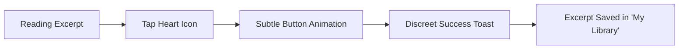

# UX Design Specification Readeel

**Author:** Etienne
**Date:** 2026-04-10

---

<!-- UX design content will be appended sequentially through collaborative workflow steps -->

## Core Vision

Readeel is a mobile application (Flutter) that lets users scroll through book excerpts in a TikTok/Reels-style vertical feed. Each excerpt card shows a passage from a book, the author, the cover, and a button to buy the full book. The goal is to help people discover books they'll love by reading short, engaging excerpts.

## Recommendation Strategy

The app aims to implement an algorithm inspired by TikTok and Instagram Reels, proposing the best book excerpts based on user preferences and best-selling trends.

## Executive Summary

### Project Vision

Readeel aims to reinvent book discovery by transposing the bookstore "browsing" experience into a modern, addictive digital format. The application uses impactful text and audio excerpts, presented in a "Reels-style" vertical feed, to spark immediate curiosity ("I want to know the sequel") and facilitate book purchases via seamless affiliate links.

### Target Users

*   **Intellectual "Snacker":** User accustomed to social media (TikTok, Instagram) looking for a richer, more cultural alternative for downtime (commutes, waiting rooms).
*   **Inspiration Seeker:** Reader who feels overwhelmed by current offerings and seeks a simple, instant way to "taste" a book before committing.
*   **Nomadic Listener:** User who prefers audio consumption or alternates between reading and listening depending on context (bedtime reading vs. noisy commute).

### Key Design Challenges

*   **The Cliffhanger Effect:** Designing an interface that highlights the end of the excerpt to transform curiosity into purchase action without being intrusive.
*   **Multimodal Experience:** Fluidly synchronizing text and audio to allow a natural transition between the two (e.g., text highlighting during listening).
*   **Mobile Micro-Reading:** Optimizing typography and layout so that 2500 characters do not feel daunting on a small screen.

### Design Opportunities

*   **Rhythmic Discovery:** Leveraging a recommendation algorithm based on both user tastes and sales performance, creating a virtuous cycle of popular discoveries.
*   **Literary Immersion:** Creating an aesthetic that marries the modernity of social apps with the elegant codes of the book world (beautiful typography, subtle paper textures).

## Core User Experience

### Defining Experience

**"The Literary Flow"**
The experience defines Readeel as an infinite feed where stories come to the user. Unlike an active search, the user lets themselves be carried by a multimedia narrative rhythm (audio + text) that starts instantly with each scroll.

### User Mental Model

*   **From Search to Discovery:** The user abandons the usual mental model of "book search" (often laborious) for a "cultural snacking" model. They are not there to buy; they are there to live a moment, and the purchase becomes a natural consequence of the pleasure experienced.
*   **Reading Affordance:** The design must immediately indicate that it is a reading object (typography, layout) while maintaining the ease of use of a social network (scroll).

### Success Criteria

*   **Zero-Friction (Fluidity):** The transition between two excerpts must be instantaneous. Audio must start without perceptible buffering.
*   **Immediate Focus (Legibility):** As soon as a user stops, their eyes should naturally fall on the line of text being read, without visual searching effort.
*   **"Cliffhanger" Engagement:** The experience is successful when the user reaches the end of the excerpt wondering: "And then what?"

### Novel UX Patterns

*   **Zen-Scroll:** Combining the fluidity of TikTok scrolling with the calm of an e-reader.
*   **Visual Anchor (Karaoke):** An intelligent highlighting system that guides the eye without being distracting, allowing reading while listening.

### Experience Mechanics

1.  **Arrived on a Card:** Immediate de-chaining of audio (subtle fade-in) + visual synchronization of text.
2.  **Passive Interaction:** User listens and reads. Interface controls gently fade out to maximize reading area.
3.  **Active Interaction (Scroll):** Vertical swipe to reject current excerpt and move to a new story.
4.  **Acquisition:** Simple tap on the purchase or favorite button to memorize the discovery.

## Platform Strategy

*   **Mobile First (Flutter):** A native application optimized for touch interaction.
*   **Monetization Axis:** Priority integration of Amazon affiliate links via a clear action button located directly under each excerpt.
*   **Feedback Loop:** A favorites system for long-term saving and tracking of clicks to Amazon to optimize future recommendations (avoiding books already purchased).

## Effortless Interactions

*   **Autoplay Audio:** Immediate audio launch upon landing on a card for an instant entry into the story.
*   **Visual Sync:** Text highlighting or automatic scrolling synced with the voice, which can be disabled based on user preference.
*   **Quick Favorite:** A simple gesture or button to remember a discovery without interrupting the reading flow.

### Critical Success Moments

*   **The "Capture":** When a user stops scrolling because the synced audio and text hooked them in the first few seconds.
*   **"Curiosity Rewarded":** The moment a user clicks "Buy on Amazon" because the excerpt ended on a peak of interest.

### Experience Principles

*   **Engagement through Rhythm:** Prioritize quality of immersion over the quantity of swipes.
*   **Conscious Discovery:** Every scroll is a user choice, rewarded by an immediate sensory experience (audio + visual).
*   **Purchase Fluidity:** The path to the full book should be a natural extension of enjoying the excerpt.
*   **Continuous Learning:** The interface evolves based on user preferences (favorites) and purchase intent.

## Desired Emotional Response

### Primary Emotional Goals

*   **Captivating Curiosity (Cliffhanger):** The immediate desire to know "what happens next," transforming passive reading into an active search for history.
*   **Literary Serenity:** A sense of calm and focus provided by a clean interface, allowing total immersion in words without distractions.
*   **Serendipity (Happy Discovery):** The joy of stumbling upon an unexpected book that resonates personally, creating a sense of intellectual reward.

### Emotional Journey Mapping

*   **Discovery (Dashboard/Feed):** Intrigue and welcome. No visual overload, just a promise of history.
*   **Central Action (Reading/Listening):** State of "Flow". The user forgets the interface and only sees the text and hears the voice.
*   **Transition (End of excerpt):** Positive tension. The user feels the urge to continue ("I need this book").
*   **Final Action (Purchase/Favorite):** Accomplishment and anticipation of the full reading pleasure.

### Micro-Emotions

*   **Trust:** A sense of quality in the face of a classic literary source and a relevant recommendation.
*   **Satisfaction:** Sensory pleasure linked to the perfect synchronization between text and audio.
*   **Inspiration:** Mind stimulated by striking or poetic passages.

### Design Implications

*   **Zen & Serif:** Use of elegant Serif fonts and generous white space to induce calm.
*   **Liquid Transitions:** Fluid and organic scroll animations to maintain the state of flow.
*   **Subtle Feedback:** Interactions (favorites, purchase) must be muted, not breaking the mood with aggressive sounds or flashes.

### Emotional Design Principles

*   **Immersion Priority:** Any design choice that breaks reading flow must be discarded.
*   **Respect for Attention:** No intrusive notifications or loud calls to action.
*   **Timeless Elegance:** The interface must fade away in favor of the literary work.

## UX Pattern Analysis & Inspiration

### Inspiring Products Analysis

*   **TikTok / Instagram Reels:** Adoption of the vertical single-handed scrolling pattern, creating frictionless exploration.
*   **Spotify / Apple Music:** Use of the "Lyrics-sync" pattern to guide the eye at the rhythm of the audio.
*   **Medium / Kindle:** Inspiration for typographic clarity, use of Serif fonts, and visual comfort during on-screen reading.

### Transferable UX Patterns

*   **Rhythmic Revelation (Karaoke Text):** Text unfolds or highlights at the rhythm of the audio to promote focus.
*   **Minimalist Control:** An interface that fades away (autohide) during reading to leave only text and audio.
*   **Single-Action Conversion:** A single, non-intrusive action button to purchase the book.

### Anti-Patterns to Avoid

*   **"Ad-Feel" UI:** Eviting colors, fonts, or placements that evoke advertising (e.g., flashing buttons, aggressive top/bottom banners).
*   **Over-Clutter:** Not overloading the screen with too many metadata while the user is reading.
*   **Forced Automation:** Scrolling must never be automatic; the user retains control over moving to the next excerpt.

### Design Inspiration Strategy

*   **Adopt:** Vertical infinite scroll, as it is naturally anchored in current mobile habits.
*   **Adopt:** "Karaoke Text" in a toggleable mode to adapt to everyone's reading speed.
*   **Avoid:** Any visual element that interrupts the state of "Flow" or devalues the excerpt by making it look like a promotional message.

## Design System Foundation

### Design System Choice

**Themeable System (Customized Material 3)**
We will use the power and robustness of **Material Design 3** as a structural foundation, while applying deep customization of "Design Tokens" to create the specific visual identity for Readeel.

### Rationale for Selection

*   **Speed and Reliability:** By relying on proven Flutter/Material components, we ensure a high-performing and accessible application from the MVP.
*   **Strong Brand Identity:** Deep customization (typography, colors, shapes) will erase the standard look and infuse a "Premium E-reader" aesthetic.
*   **Scalability:** This system allows for easy addition of new features while maintaining perfect visual consistency.

### Implementation Approach

*   **Flutter ThemeData:** Centralizing all styles (colors, fonts, button themes) in the application's global `ThemeData`.
*   **Layering:** Using Material components for structure (Scaffolds, Sheets) and custom components for the core experience (Excerpt cards, Audio player).

### Customization Strategy

*   **Typography:** Selecting a high-quality Serif font for the excerpt text and a modern Sans-Serif font for UI elements.
*   **Color Palette:** Using "paper" tones (cream, soft charcoal gray) to promote prolonged reading without eye strain.
*   **Micro-interactions:** Creating fluid and "liquid" transitions for vertical scrolling, moving away from standard animations.

## Visual Design Foundation

### Color System

We will use two main themes centered on reading comfort (eye-comfort):

*   **"Antique Paper" Mode (Light):**
    *   *Background:* `#FDFCF0` (Soft cream, reduces eye strain compared to pure white).
    *   *Text:* `#1A1A1B` (Deep charcoal for optimal contrast).
    *   *Accent:* `#C4A484` (Leather brown for selection/favorite elements).
*   **"Nocturnal" Mode (Dark):**
    *   *Background:* `#121212` (Deep matte black).
    *   *Text:* `#E1E1E1` (Soft pearl gray to avoid glare).
    *   *Accent:* `#8D6E63` (Earthy tones for interactions).

### Typography System

*   **Excerpt Text (Serif): *Merriweather***
    *   *Rationale:** Designed specifically for on-screen reading, offering excellent legibility and undeniable literary elegance.
*   **Interface & UI (Sans-Serif): *Inter***
    *   *Rationale:** A modern, clear, and professional font, perfect for buttons and metadata (Author, Title).
*   **Hierarchy:** Use of varied weights (Bold for author, Regular for text) with generous line height (1.6) for reading.

### Spacing & Layout Foundation

*   **"Airy" Principle:** Using an 8px-based grid system, but with very wide internal margins (padding) on excerpt cards to avoid any feeling of clutter.
*   **Vertical Centering:** Excerpt text will be vertically centered so user's eyes always rest in the same place with each scroll.

### Accessibility Considerations

*   **High Contrast:** Strict adherence to WCAG AAA standards for all reading text.
*   **Text Scaling:** The interface will be designed to support text enlargement without breaking layout.

## Design Direction Decision

### Design Directions Explored

We explored 4 directions ranging from extreme minimalism ("The Pure Reader") to a more social approach ("The Fast Snacking"). Each direction respected our "Antique Paper" foundation and used high-quality serif typography.

### Chosen Direction

**Direction 2: Immersive Audio-Visual**
This direction was chosen for its ability to create an enveloping atmosphere. The use of textures, artistic blurs on covers, and an elegant audio progress bar reinforces the feeling of "living" a story rather than just reading it.

### Design Rationale

*   **Sensory Immersion:** The visual treatment (background blur) reduces peripheral distractions and focuses attention on the central text.
*   **Rhythmic Feedback:** The audio progress bar provides a reassuring temporal reference that aligns with the "textual karaoke" concept.
*   **Premium Elegance:** This approach gives Readeel a high-end look, far from the sometimes "raw" aesthetics of classic social networks.

### Implementation Approach

*   **Flutter Effects:** Use of `BackdropFilter` for blur effects and `Gradients` to ensure text legibility on any background.
*   **Audio Visualizer:** Development of a custom component for audio progress, organically integrated under the text.
*   **Fluid Transitions:** Excerpt cards will use "smooth" transitions to move from one book to another without breaking immersion.

## User Journey Flows

### 1. The Literary Flow (Infinite Discovery)
The core experience where users let themselves be carried by stories.

```mermaid
graph TD
    A[App Launch / Scroll] --> B{Content Loaded?}
    B -- No --> C[Skeleton Screen (Elegant)]
    B -- Yes --> D[Audio Fade-in + Text Karaoke]
    D --> E[Reading/Listening Flow]
    E --> F{User Action}
    F -- Vertical Scroll --> A
    F -- Tap Favorite --> G[Library Add]
    F -- Tap Purchase --> H[Amazon Affiliate Link]
```

### 2. The "Coup de Cœur" (Favorites)
Saving a discovery for later.



### 3. The Acquisition (Secure Purchase)
Converting curiosity into a book purchase.

```mermaid
graph LR
    A[End of Excerpt / Amazon Button] --> B[Tap Purchase Button]
    B --> C[Open External Browser (Amazon)]
    C --> D[Seamless Return to App]
```

### Flow Optimization Principles

*   **Zero Interruption:** Audio should never stop abruptly between scrolls (ideal cross-fade).
*   **Visual Guidance:** The purchase button is the primary visual anchor after the text, guiding the final action without clutter.
*   **Immediate Feedback:** Every interaction provides instant sensory confirmation to maintain the state of flow.

## Component Strategy

### Design System Components (Material 3)
*   **Foundation:** Scaffold, Navigation Bar, Card, Typography, Icons.
*   **Actions:** Extended Floating Action Button (for purchase links with custom paper texture).
*   **Indicators:** Linear Progress Indicator (adapted for subtle audio progress).

### Custom Components

#### 1. ExcerptCard
**Purpose:** The central unit of the app, managing full-screen display, background blur, and text centering.
**Implementation:** Uses Flutter's `BackdropFilter` for blur and `Stack` for information layering.

#### 2. KaraokeTextViewer
**Purpose:** Custom text renderer synchronized with audio timestamps.
**Feature:** Sentence-level highlighting and "jump-to-time" interaction on tap.

#### 3. AmbientAudioPlayerOverlay
**Purpose:** Manages audio fades and automatic UI auto-hide to maximize immersion.
**Behavior:** Controls gently fade out when user is inactive and reading.

### Component Implementation Strategy
*   Build custom components using Material 3 design tokens (Colors, Spacing).
*   Ensure high performance in `ExcerptCard` to maintain the TikTok-style scrolling fluidity (60fps).
*   Follow accessibility requirements for screen readers in both UI and excerpt content.

### Implementation Roadmap

**Phase 1 - Core:** `ExcerptCard` and `KaraokeTextViewer`.
**Phase 2 - Interaction:** Purchase & Favorite buttons with micro-animations.
**Phase 3 - Polish:** Motion blur on scroll and "liquid" transitions between cards.

## UX Consistency Patterns

### Button Hierarchy

*   **Primary Action (Purchase):** Solid button in "Leather/Earth" color (`#C4A484`). This is the only "solid" element designed to attract the eye at the end of an excerpt.
*   **Secondary Action (Favorite/Share):** Discreet wireframe icons or subtle outlines on the side of the screen. They must never compete with the text.
*   **Navigation Actions:** Standard Material 3 icons within the NavigationBar for instant user recognition.

### Navigation Patterns

*   **The Flow (Main Feed):** Vertical-only navigation. Swipe up to pass to the next book.
*   **App Sections:** Material 3 Bottom Navigation with 3 clear destinations:
    1.  *Discover* (Main Flow)
    2.  *My Library* (Favorites & History)
    3.  *Profile* (Reading Preferences)

### Feedback & States

*   **Confirmation:** Non-intrusive. Use of discrete "Snackbars" with a cream background and Serif typography to maintain the literary mood.
*   **Loading States:** "Skeleton Screens" that mimic the exact text layout to prevent visual jumps.
*   **Error States (e.g., Offline):** Minimalist "sketch-style" illustrations with a clear retry CTA, staying true to the paper aesthetic.

### Design System Integration

All patterns utilize the predefined Design Tokens (Paper color, Merriweather font, 8px spacing), ensuring total harmony between functional mechanics and user experience.


